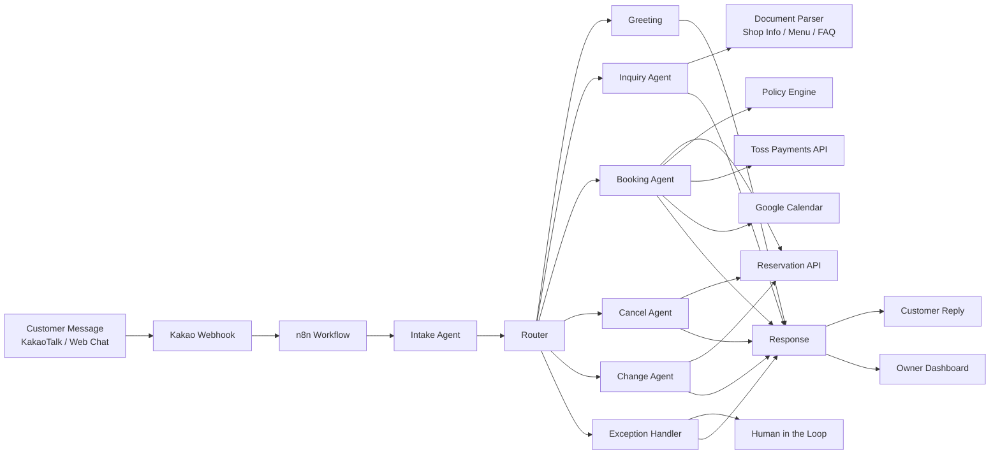

# Reservia

<p align="center">
  
</p>

<p align="center">
  <b>고객의 비정형 예약 메시지를 구조화하여 예약 문의, 변경, 취소, 결제 확인, 일정 등록까지 자동 처리하는<br/>네일샵 사장님을 위한 AI 예약 응대 매니저</b>
</p>

<p align="center">
  <b>Team Nailgent</b> · 🏆 2026 Low-Code AI Challenge Hackathon 3rd place
</p>

### Team Nailgent

| Role | Name | GitHub |
|---|---|---|
| AI / Agent | 김미지 | [@miji0](https://github.com/miji0) |
| AI / Agent | 김지수 | [@sallysooo](https://github.com/sallysooo) |
| Backend / Infra | 남민서 | [@minseo0313](https://github.com/minseo0313) |
| Frontend / Design | 정교은 | [@kyooonnnggg](https://github.com/kyooonnnggg) |

---

# n8n Workflow
<p align="center">
  
</p>


## 1. Project Overview

<p align="center">
  
</p>


**Reservia**는 1인 네일샵과 소규모 예약 기반 업종의 사장님들을 위한 AI 예약 자동화 서비스입니다. 고객은 카카오톡이나 웹 채팅에서 평소처럼 자유롭게 문의하고, 시스템은 해당 메시지에서 예약에 필요한 정보를 추출하여 예약 가능 여부 확인, 누락 정보 재질문, 예약금 결제 확인, Google Calendar 등록, 예약 변경 및 취소까지 자동으로 처리합니다.

기존 예약 서비스는 정해진 입력 양식에 맞춰 날짜와 시간을 선택하는 방식에 가깝습니다. 하지만 실제 네일샵 예약 문의는 다음처럼 훨씬 자유롭고 복잡합니다.

```text
내일 오후 3시에 젤 제거하고 젤네일 가능해요?
첫방문이고 이름은 김지수예요.
```

Reservia는 이런 자연어 메시지를 읽고 다음과 같은 구조화된 정보로 변환합니다.

```json
{
  "intent": "booking",
  "slots": {
    "customer_name": "김지수",
    "requested_date": "tomorrow",
    "requested_time": "15:00",
    "service": "gel_nail",
    "remove_old_gel": true,
    "is_first_visit": true
  },
  "missing_fields": ["phone_number"],
  "next_action": "ask_missing_field"
}
```

그리고 필요한 정보가 부족하면 고객에게 자동으로 다시 질문합니다.

```text
안녕하세요 김지수 고객님 😊
예약을 도와드리기 위해 전화번호도 함께 알려주시겠어요?
```

---

## 2. Problem Statement

소규모 네일샵 사장님은 시술 중에도 계속 들어오는 예약 문의를 직접 확인해야 합니다. 고객 문의는 카카오톡, 네이버 톡톡, 인스타그램 DM 등 여러 채널로 흩어져 있고, 문의 형식도 모두 다릅니다.

반복적으로 발생하는 문제는 다음과 같습니다.

| 문제 | 설명 |
|---|---|
| 비정형 문의 | 고객이 정해진 양식 없이 자유롭게 예약 요청을 보냅니다. |
| 반복 확인 | 이름, 전화번호, 희망 시간, 시술 옵션, 제거 여부 등을 매번 다시 확인해야 합니다. |
| 예약 가능 여부 확인 | 사장님이 직접 캘린더를 보고 가능한 시간대를 확인해야 합니다. |
| 변경/취소 처리 | 기존 예약을 찾아서 변경 가능 여부와 정책을 확인해야 합니다. |
| 선입금 확인 | 예약금 입금 여부를 확인한 뒤 최종 예약 확정을 해야 합니다. |
| 정보 관리 어려움 | 가격표, 운영시간, 예약 정책이 바뀌면 고객 응대 내용도 함께 수정해야 합니다. |

Reservia는 이러한 수작업을 AI와 자동화 워크플로우로 연결하여 사장님의 예약 응대 부담을 줄이는 것을 목표로 합니다.

---

## 3. Target Users

### Main Target

- 1인 네일샵 사장님
- 소규모 네일샵 직원
- 예약 문의와 옵션 선택을 직접 관리하는 뷰티샵 운영자

### Future Expansion

Reservia의 구조는 네일샵뿐 아니라 다음과 같은 예약 기반 업종으로 확장할 수 있습니다.

- 케이크샵
- 꽃집
- 공방 클래스
- 에스테틱 / 속눈썹 / 왁싱샵
- 원데이 클래스
- 렌탈 스튜디오
- 기타 맞춤형 예약이 필요한 소상공인 업종

---

## 4. Key Features

### 4.1 비정형 자연어 예약 문의 처리

고객이 정해진 양식 없이 자유롭게 작성한 메시지를 분석합니다. 시스템은 고객 메시지에서 예약 의도와 필요한 slot을 추출하고, 누락된 정보가 있으면 자동으로 재질문합니다.

예시:

```text
고객: 내일 3시에 젤 제거하고 젤네일 가능해요?
시스템: 가능 여부를 확인해드릴게요. 성함과 전화번호도 함께 알려주시겠어요?
```

### 4.2 예약 가능 시간 확인 및 대체 시간 제안

고객이 요청한 시간이 이미 예약되어 있거나 영업시간과 맞지 않는 경우, Google Calendar와 예약 데이터를 확인하여 가능한 대체 시간대를 제안합니다.

예시:

```text
요청하신 오후 3시는 이미 예약이 있어요.
대신 오후 4시, 5시 30분, 7시 예약이 가능합니다.
원하시는 시간대를 선택해주세요 😊
```

### 4.3 예약금 결제 확인 후 최종 예약 확정

예약은 바로 확정되지 않고, 예약금 결제 또는 입금 확인 이후 최종 확정됩니다. 결제 상태가 확인되면 예약 상태를 업데이트하고 고객과 사장님에게 확정 메시지를 전송합니다.

### 4.4 예약 변경 및 취소 자동 처리

고객이 예약 변경이나 취소를 요청하면 기존 예약을 조회하고, 정책에 따라 변경 가능 여부를 판단합니다. 가능한 경우 예약 정보를 수정하고, 불가능하거나 애매한 경우 사장님 검토로 넘깁니다.

### 4.5 기타 문의 응대

운영시간, 가격, 위치, 예약금, 시술 옵션 등 일반 문의는 샵 정보와 고객 정보를 기반으로 응답합니다. 단순 FAQ를 넘어, 사장님이 등록한 정책과 가격 정보를 바탕으로 답변할 수 있습니다.

### 4.6 Document Parsing 기반 샵 정보 관리

사장님은 가격표나 안내문 이미지를 업로드할 수 있습니다. 시스템은 문서/이미지에서 텍스트를 추출하고, 이를 고객 응대 정보로 활용합니다.

예시 활용:

- 가격표 이미지에서 시술명과 가격 추출
- 운영시간 안내문에서 영업시간 추출
- 예약 정책 문서에서 예약금/취소 규정 추출
- 추출된 정보를 Inquiry Agent의 응답 근거로 활용

### 4.7 관리자 대시보드

사장님은 웹 대시보드에서 다음 정보를 확인하고 관리할 수 있습니다.

- 샵 정보 관리
- 고객 목록 관리
- 예약 목록 관리
- 일정 관리
- 예약 상태 확인
- 결제 상태 확인
- 고객이 업로드한 네일 디자인 이미지 확인

---

## 5. System Architecture

Reservia는 고객 메시지를 단순히 LLM에 전달해 답변하는 챗봇이 아닙니다. 고객 입력을 구조화하고, 예약 업무에 필요한 여러 시스템을 연결하는 **AI workflow automation system**입니다.

전체 구조는 다음과 같습니다.



---

## 6. Agent Workflow

<p align="center">
  
</p>

n8n은 Reservia의 핵심 자동화 흐름을 연결하는 orchestration layer입니다. 고객 메시지가 들어오면 n8n workflow가 이를 수신하고, Intake Agent와 Router를 거쳐 목적에 맞는 하위 agent 또는 API로 연결합니다.

### 6.1 Workflow Summary

| Step | Component | Role |
|---|---|---|
| 1 | Kakao Webhook | 고객 메시지 수신 |
| 2 | Intake Agent | 의도 분류, slot 추출, 누락 정보 감지 |
| 3 | Simple Memory / Customer DB | 기존 고객 여부 및 대화 상태 확인 |
| 4 | Router | Greeting, Inquiry, Booking, Cancel, Change, Exception으로 분기 |
| 5 | Inquiry Agent | 가격, 운영시간, 정책 등 기타 문의 응대 |
| 6 | Booking Agent | 신규 예약 등록 및 가능 여부 확인 |
| 7 | Policy Engine | 영업시간, 예약 가능 여부, 예외 조건 판단 |
| 8 | Payments Flow | Toss Payments API를 통한 예약금 결제 확인 |
| 9 | Google Calendar | 확정 예약 일정 등록 |
| 10 | Cancel / Change Agent | 기존 예약 조회 후 취소 또는 변경 처리 |
| 11 | Response | 고객에게 최종 응답 반환 |

### 6.2 Shared State

n8n workflow에서는 고객 메시지를 처리하기 위해 다음과 같은 상태값을 유지합니다.

| Field | Description |
|---|---|
| `kakao_user_id` | 카카오 사용자 식별자 |
| `user_input` | 고객의 원본 메시지 |
| `intent` | 예약, 문의, 변경, 취소 등 고객 의도 |
| `slots` | 이름, 전화번호, 날짜, 시간, 시술 옵션 등 추출된 정보 |
| `missing_fields` | 예약 처리를 위해 추가로 필요한 정보 |
| `is_bookable` | 현재 요청이 예약 가능한 상태인지 여부 |
| `booking_status` | 예약 상태 |
| `policy_result` | 정책 검증 결과 |
| `next_action` | 다음에 수행해야 할 작업 |
| `response_draft` | 고객에게 보낼 응답 초안 |

---

## 7. Core Agents

### 7.1 Intake Agent

Intake Agent는 모든 고객 메시지가 처음 도착하는 진입점입니다.

주요 역할:

- 고객 의도 분류
- 예약 관련 slot 추출
- 누락 정보 감지
- 기존 고객 여부 확인
- 다음 workflow 분기 결정

예시:

```json
{
  "intent": "booking",
  "slots": {
    "name": "김지수",
    "date": "tomorrow",
    "time": "15:00",
    "service": "gel_nail",
    "remove_old_gel": true
  },
  "missing_fields": ["phone_number"],
  "next_action": "ask_missing_field"
}
```

### 7.2 Greeting

처음 방문한 고객 또는 신규 대화에 대해 환영 메시지를 제공합니다.

주요 역할:

- 신규 고객 안내
- 기본 예약 절차 안내
- 필요한 정보 입력 유도

### 7.3 Inquiry Agent

예약 외의 일반 문의를 처리합니다.

주요 역할:

- 가격 문의 응답
- 운영시간 안내
- 위치/연락처 안내
- 예약금 및 취소 정책 안내
- 문서 파싱 결과를 기반으로 한 샵 정보 응답

Inquiry Agent는 메뉴 이미지 또는 가격표에서 추출된 텍스트를 활용할 수 있습니다. 응답이 불확실하거나 자동 답변이 위험한 경우 human-in-the-loop로 전환합니다.

### 7.4 Booking Agent

신규 예약을 담당합니다.

주요 역할:

- 예약 slot 검증
- 시술 옵션 확인
- 샵 운영시간 확인
- 예약 가능 시간 조회
- 예약 draft 생성
- 예약금 결제 대기 상태 처리
- 결제 확인 후 예약 확정
- Google Calendar 등록

### 7.5 Cancel Agent

고객의 예약 취소 요청을 처리합니다.

주요 역할:

- 기존 예약 조회
- 취소 가능 여부 확인
- 취소 정책 적용
- 예약 삭제 또는 취소 상태 반영
- 고객에게 취소 결과 안내

### 7.6 Change Agent

고객의 예약 변경 요청을 처리합니다.

주요 역할:

- 기존 예약 조회
- 변경 희망 시간 추출
- 새 시간대 availability 확인
- 변경 가능 여부 판단
- 예약 정보 수정
- 고객에게 변경 결과 안내

### 7.7 Exception Handler

정상적인 자동 처리 흐름으로 해결하기 어려운 요청을 담당합니다.

예외 상황 예시:

- 고객 요청이 너무 모호한 경우
- 예약 정책과 충돌하는 경우
- 결제는 되었지만 예약 정보가 불완전한 경우
- 기존 예약을 찾을 수 없는 경우
- backend error가 발생한 경우
- 사람이 직접 판단해야 하는 이미지/디자인 요청인 경우

이 경우 시스템은 무리하게 자동 확정하지 않고 사장님 검토로 넘깁니다.

---

## 8. Main User Scenarios

### Scenario 1. 신규 예약

```text
고객: 내일 오후 3시에 젤 제거하고 젤네일 가능해요? 첫방문이고 이름은 김지수예요.
```

시스템 처리:

1. `booking` intent로 분류
2. 이름, 날짜, 시간, 시술 옵션, 제거 여부 추출
3. 전화번호 누락 감지
4. 고객에게 전화번호 재질문
5. 예약 가능 시간 확인
6. 예약금 결제 안내
7. 결제 확인 후 예약 확정
8. Google Calendar 등록

### Scenario 2. 예약 시간 불가 및 대체 시간 제안

```text
고객: 오늘 10시로 예약할게요.
```

시스템 처리:

1. 요청 시간대 확인
2. 이미 예약이 있거나 불가능한 시간인지 판단
3. 가능한 대체 시간대 조회
4. 고객에게 대체 시간 제안

### Scenario 3. 기타 문의

```text
고객: 네일 가격이 궁금해요.
```

시스템 처리:

1. `inquiry` intent로 분류
2. 샵 정보 및 가격표 데이터 조회
3. 가격표 이미지에서 추출된 정보 활용
4. 고객에게 가격 안내

### Scenario 4. 예약 취소

```text
고객: 예약 취소하고 싶어요.
```

시스템 처리:

1. `cancel` intent로 분류
2. 기존 예약 조회
3. 취소 정책 확인
4. 취소 가능 시 예약 삭제 또는 상태 변경
5. 고객에게 결과 안내

### Scenario 5. 예약 변경

```text
고객: 내일 예약을 모레 오후 2시로 바꿀 수 있나요?
```

시스템 처리:

1. `change` intent로 분류
2. 기존 예약 조회
3. 변경 희망 시간 추출
4. 새 시간대 가능 여부 확인
5. 예약 정보 수정 또는 대체 시간 제안

---

## 9. Frontend Dashboard

Reservia는 고객 응대 자동화뿐 아니라, 사장님이 예약과 샵 정보를 관리할 수 있는 dashboard를 제공합니다.

### 9.1 Shop Info Management

사장님은 다음 정보를 직접 등록하거나 수정할 수 있습니다.

- 운영시간
- 예약금
- 가게 위치
- 예약 양식
- 대표 가격
- 예약 멘트
- 정책 안내
- 가격표/안내문 이미지

Document Parsing을 통해 가격표 이미지를 업로드하면, 시스템이 텍스트 정보를 추출하여 고객 응대에 활용할 수 있습니다.

### 9.2 Customer Management

고객 탭에서는 고객 이름, 전화번호, 예약 이력, 노쇼 여부 등을 관리할 수 있습니다.

### 9.3 Reservation Management

예약 탭에서는 예약 목록과 예약 상태를 확인합니다.

관리 가능한 정보 예시:

- 고객명
- 시술명
- 예약 날짜 및 시간
- 예약금 상태
- 예약 상태
- 고객이 업로드한 네일 디자인 이미지

### 9.4 Schedule Management

일정 탭에서는 Google Calendar와 연동된 예약 일정을 확인할 수 있습니다. 확정된 예약은 캘린더에 자동 등록되어 사장님이 실시간으로 확인할 수 있습니다.

---

## 10. Backend & Integrations

Reservia는 다음 외부 시스템과 연동됩니다.

| Integration | Purpose |
|---|---|
| Kakao Webhook | 고객 메시지 수신 |
| Upstage Solar Pro | 자연어 이해 및 응답 생성 |
| Upstage Document Parser | 가격표/안내문 문서 파싱 |
| Customer DB | 고객 정보 및 기존 예약 조회 |
| Reservation API | 예약 생성, 변경, 취소 |
| Policy Engine | 영업시간, 예약 가능 여부, 예외 조건 판단 |
| Toss Payments API | 예약금 결제 확인 |
| Google Calendar API | 확정 예약 일정 등록 |
| Frontend Dashboard | 사장님용 관리 화면 제공 |

---

## 11. MVP Scope

### In Scope

- 카카오톡/웹 기반 고객 메시지 수신
- 자연어 의도 분류
- 예약 slot 추출
- 누락 정보 재질문
- 신규 예약 처리
- 예약 가능 시간 확인
- 대체 시간대 제안
- 예약금 결제 확인
- Google Calendar 등록
- 예약 변경/취소 처리
- 가격표/운영정보 기반 기타 문의 응대
- 사장님용 관리자 화면

### Out of Scope for Current MVP

- 완전 자동 환불 처리
- 복수 디자이너 최적 배정
- 고난도 네일 디자인 이미지 자동 판별
- 여러 지점 동시 운영
- 모든 업종에 대한 완전 일반화

---

## 12. Future Work

- 네일샵 외 예약 업종 확장
- 업종별 정책 템플릿 제공
- 고객 재방문/노쇼 이력 기반 예약 정책 고도화
- 가격표/안내문 자동 파싱 정확도 개선
- 고객 맞춤형 추천 응답 생성
- 복수 직원/디자이너 스케줄링 지원
- CRM 및 마케팅 자동화 연동

---

